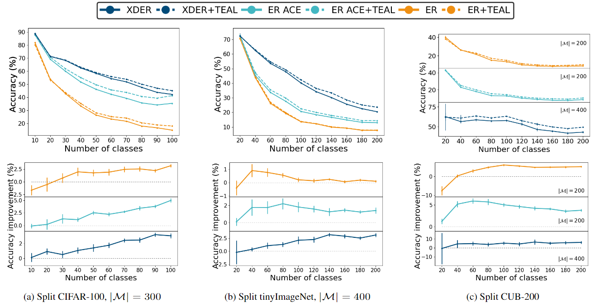

# TEAL Official Code Repository

This is the official implementation for the paper **TEAL: New Selection Strategy for Small Buffers in Experience Replay Class Incremental Learning**. [**Arxiv link**](https://arxiv.org/abs/2407.00673)

This code implements **TEAL** - Simple and effective selection strategy for experience replay methods.

TEAL operates in a Continual Learning environment, leveraging the trained model after each task to extract features. In an iterative process for each class, it clusters the data into 
𝑘 clusters and selects the most typical (densest) sample from each uncovered cluster. TEAL constructs a diverse, representative set of exemplars for the memory buffer, which is later used when the model learns new tasks. This method is particularly effective for small buffer sizes but can also benefit larger buffers.




## Getting Started

This repository provides two experimental frameworks as described in the paper. The frameworks allow you to explore and compare different methods in Class Incremental Learning (CIL), focusing on the evaluation of TEAL selection strategy.

### Setup

Before running the experiments, make sure to update the dataset paths in the `cl_pipeline.py` file to match your local environment. 

#### Environment Setup

To ensure compatibility and ease of use, follow the steps below to set up your environment:

```bash
# Create a new Conda environment with Python 3.7
conda create --name teal python=3.7 -y

# Activate the newly created environment
conda activate teal

# Install PyTorch, torchvision, torchaudio, and the appropriate CUDA toolkit
# Replace <CUDA_VERSION> with your CUDA version (e.g., 11.3)
conda install pytorch torchvision torchaudio cudatoolkit=<CUDA_VERSION> -c pytorch -y

# Install additional required libraries: Matplotlib, SciPy, scikit-learn, and pandas
conda install matplotlib scipy scikit-learn pandas -y

# Install FAISS with GPU support
conda install -c conda-forge faiss-gpu -y

# Install the Avalanche library
pip install avalanche-lib
```
   
### Frameworks

1. **ER-IL Baselines**:
    - This framework allows you to run the ER and ER-ACE methods with their original selection strategies or with TEAL.
    - You can also add and evaluate new ER-IL baselines.

2. **Selection Strategies Baselines**:
    - Run the basic ER-IL method called "Naive Replay" (`naive_replay`) with different selection strategies such as TEAL, Herding, Uncertainty, Centered, or random sampling.

## Usage

The main script accepts various arguments to configure and run experiments. Below is a detailed explanation of these arguments.

- `--dataset`: (str, required) The name of the dataset to use. Options include `cifar10`, `cifar100`, `tinyimg`, or `cub200`.
- `--num_experiences`: (int, required) Number of experiences/tasks in the experiment.
- `--algorithm`: (str, required) The algorithm to use in the experiment. Options are `er_ace`, `er`, `finetune`, or `naive_replay`.
- `--sel_strategy`: (str, default=None) Selection strategy for the replay buffer. Options include `herding`, `teal`, `rm` (for Uncertainty), `centered`, or `random`.
- `--teal_type`: (str, default='log_iterative') If the `sel_strategy` is `teal`, specifies the type of TEAL to use. Options are `one_time` or `log_iterative`.
- `--buffer`: (int, required) Size of the buffer used for experience replay.
- `--cuda_id`: (int, default=0) The ID of the CUDA device to use.
- `--inc_model`: (str, default='resnet18') The model architecture to train with. Options are `resnet18`, `arch_craft`, or `slim_resnet18`.
- `--num_epochs`: (int, default=100) Number of training epochs.
- `--batch_size`: (int, default=128) Size of each mini-batch during training.
- `--momentum`: (float, default=0.9) Momentum factor for the optimizer.
- `--weight_decay`: (float, default=0.0002) Weight decay (L2 penalty) for the optimizer.
- `--lr`: (float, default=0.1) Learning rate for training.
- `--seed`: (int, default=None) Random seed for determining the order of classes. If `None`, classes will be ordered sequentially (0, 1, 2,...).
- `--debug`: (flag, default=False) If set, runs the experiment in debug mode, providing additional output for troubleshooting.

### Example Usage

Here is an example of how to run an experiment:

#### ER-IL Baselines

1. ER 'vanilla' version
```bash
python main.py --dataset cifar100 --num_experiences 10 --algorithm er --buffer 200
```
2. ER with TEAL selection strategy
```bash 
python main.py --dataset cifar100 --num_experiences 10 --algorithm er --sel_strategy teal --teal_type log_iterative --buffer 200
```

#### Selection Strategies Baselines

1. TEAL
```bash
python main.py --dataset tinyimg --num_experiences 20 --algorithm naive_replay --buffer 400 --inc_model slim_resnet18 --sel_strategy teal --teal_type log_iterative
```
2. Herding
```bash 
python main.py --dataset tinyimg --num_experiences 20 --algorithm naive_replay --buffer 400 --inc_model slim_resnet18 --sel_strategy rm
```
